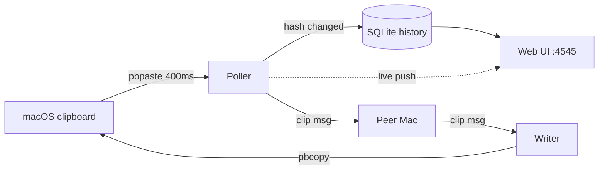
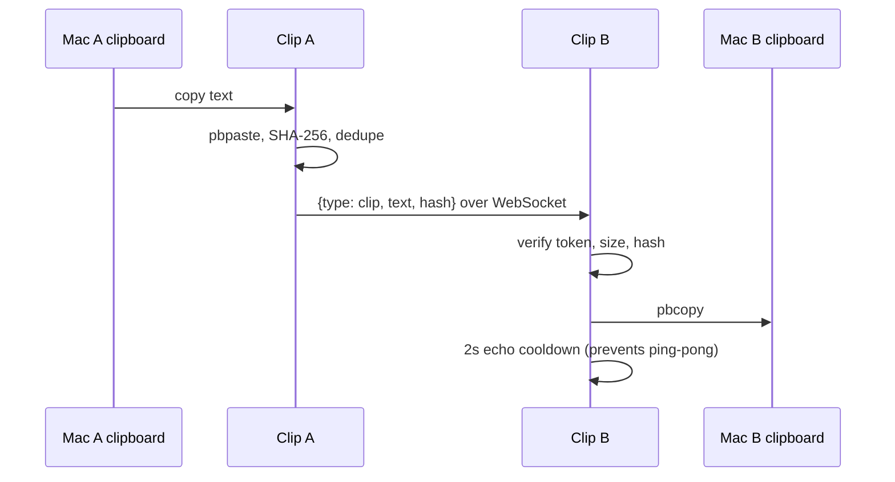

# Clip

A tiny macOS clipboard sync daemon: copy text on one Mac, it appears on the other over your LAN, with a searchable web history of everything you have copied.


[](LICENSE)


## Contents

- [Features](#features)
- [Architecture](#architecture)
- [How it works](#how-it-works)
- [Design decisions and trade-offs](#design-decisions-and-trade-offs)
- [Tech stack](#tech-stack)
- [Quick start](#quick-start)
- [Configuration](#configuration)
- [Project layout](#project-layout)
- [Security notes](#security-notes)
- [License](#license)

## Features

- Two-machine clipboard sync over the LAN via a raw WebSocket, no cloud relay.
- Bidirectional: copy on either Mac and the text lands on the other.
- SQLite-backed history (last 500 clips) with a searchable web UI at `http://localhost:4545`.
- Cmd+K command-palette search across everything you have copied.
- Per-clip actions: copy, edit in place, delete, favorite, and open a URL clip.
- Send a long clip to the [Stickies](https://github.com/bunlongheng) app in one click (optional).
- Duplicate cleanup: hash dedupe plus a fuzzy prefix pass, on demand or at boot.
- QR code and LAN URL to open the UI on your phone.
- Installs as a `launchd` agent that keeps running and restarts on crash.
- Installable PWA (manifest + icons).

## Architecture

A single Node process runs three things at once: a 400ms clipboard poller, a peer WebSocket (both server and client, so either machine can initiate), and an HTTP server that serves the web UI and a second WebSocket that pushes live updates to the browser. Clipboard changes are detected by SHA-256 hash, persisted to SQLite, and fanned out to the peer and the UI.



| Module | Role |
|--------|------|
| `src/server.js` | HTTP routes, peer WebSocket, UI WebSocket, poller, and the single-page web UI |
| `src/db.js` | SQLite persistence (better-sqlite3), dedupe and cleanup |
| `src/clipboard.js` | `pbpaste`/`pbcopy` wrapper plus SHA-256 hashing |
| `src/config.js` | Environment-backed settings (port, peer, token, limits) |

## How it works



## Design decisions and trade-offs

| Decision | Chosen | Alternative | Why this trade-off | Cost we accept |
|----------|--------|-------------|--------------------|----------------|
| Transport | Raw WebSocket over LAN | Cloud relay service | No third party ever sees your clipboard; nothing to host | Both Macs must share a network |
| Change detection | 400ms `pbpaste` poll | Native pasteboard events | Zero native dependencies, dead simple | A small recurring CPU tick |
| History storage | Local SQLite, 500-clip cap | No history, or cloud sync | Browsable, offline, self-pruning | Stored in plaintext at rest |
| Peer auth | Shared token on `/ws` | Full TLS or device pairing | Trivial to set up on a home LAN | You must set a strong `CLIP_TOKEN` |

## Tech stack

- Runtime: Node.js (macOS, uses `pbpaste`/`pbcopy`)
- HTTP: Express 4
- Realtime: `ws` WebSockets (peer sync + UI push)
- Storage: SQLite via better-sqlite3 (WAL mode)
- Tests: Vitest (unit) + Playwright (e2e) + MSW (mocked Stickies)
- Service: macOS `launchd` agent

## Quick start

```bash
git clone https://github.com/bunlongheng/clip.git
cd clip
npm install

# Machine A
CLIP_NAME=MacA CLIP_PEER=192.168.1.50:4545 CLIP_TOKEN=pick-a-strong-secret npm start

# Machine B (point CLIP_PEER at Machine A, same token)
CLIP_NAME=MacB CLIP_PEER=192.168.1.40:4545 CLIP_TOKEN=pick-a-strong-secret npm start
```

Open the web UI at `http://localhost:4545`. Copy text on either machine and it syncs to the other; every clip shows up in the grid. Use the same `CLIP_TOKEN` on both machines.

## Configuration

All configuration is environment variables (see `src/config.js`). None are strictly required to start, but you must set `CLIP_PEER` and `CLIP_TOKEN` for sync.

| Env var | Default | Purpose |
|---------|---------|---------|
| `CLIP_NAME` | machine hostname | Label shown in the UI and stored as the clip source |
| `CLIP_PORT` | `4545` | Port for the web UI and WebSocket server |
| `CLIP_PEER` | (none) | The other machine as `ip:port`; empty means no sync, UI only |
| `CLIP_TOKEN` | `clip-sync-secret` | Shared secret gating the peer WebSocket - set a strong value |
| `CLIP_POLL_MS` | `400` | Clipboard poll interval in milliseconds |
| `CLIP_MAX_BYTES` | `102400` | Max clip size synced (larger clips are kept locally, not sent) |
| `CLIP_DB_PATH` | `./clip.db` | SQLite history file location |
| `STICKIES_API_URL` | `http://localhost:4444` | Optional: base URL for the send-to-Stickies feature |

## Project layout

```
clip/
├── src/
│   ├── server.js     HTTP + peer WS + UI WS + poller + web UI
│   ├── db.js         SQLite history, dedupe, cleanup
│   ├── clipboard.js  pbpaste/pbcopy wrapper + SHA-256
│   └── config.js     env-backed settings
├── launchd/
│   └── com.bunlong.clip.plist   macOS LaunchAgent template
├── test/
│   ├── unit/         Vitest unit tests
│   ├── e2e/          Playwright specs
│   ├── helpers/      seed + factory + clip stub
│   └── msw/          mocked Stickies handlers
├── docs/screenshots/ README images
└── package.json
```

## Install as a launchd service

```bash
# Edit launchd/com.bunlong.clip.plist: set the node path, the server.js path,
# and your CLIP_PEER / CLIP_TOKEN, then:
cp launchd/com.bunlong.clip.plist ~/Library/LaunchAgents/
launchctl load ~/Library/LaunchAgents/com.bunlong.clip.plist

# Uninstall
launchctl unload ~/Library/LaunchAgents/com.bunlong.clip.plist
rm ~/Library/LaunchAgents/com.bunlong.clip.plist
```

## Security notes

Clip is built for a trusted home LAN. Keep this in mind before exposing it:

- The web UI and clip API are unauthenticated. Bind to `localhost` or a trusted network only.
- Set a strong `CLIP_TOKEN`; the default is a placeholder and gates who can inject into your clipboard.
- Clipboard history is stored unencrypted in SQLite. Do not point `CLIP_DB_PATH` at a shared location.

## License

[MIT](LICENSE) (c) Bunlong Heng
