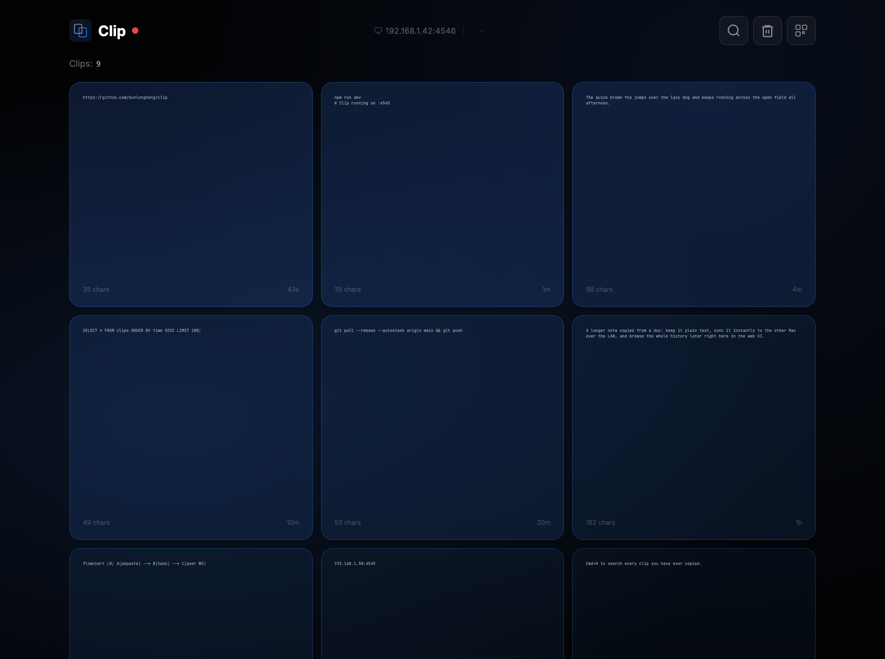
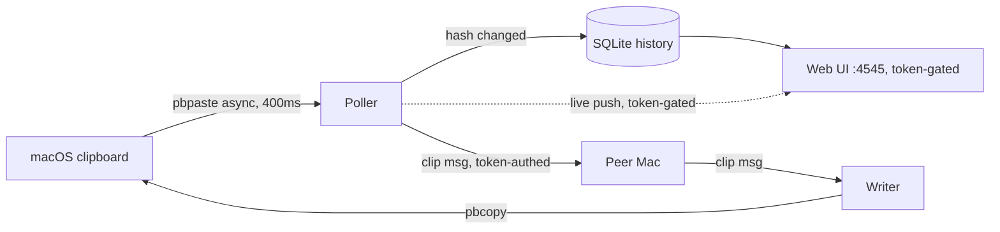
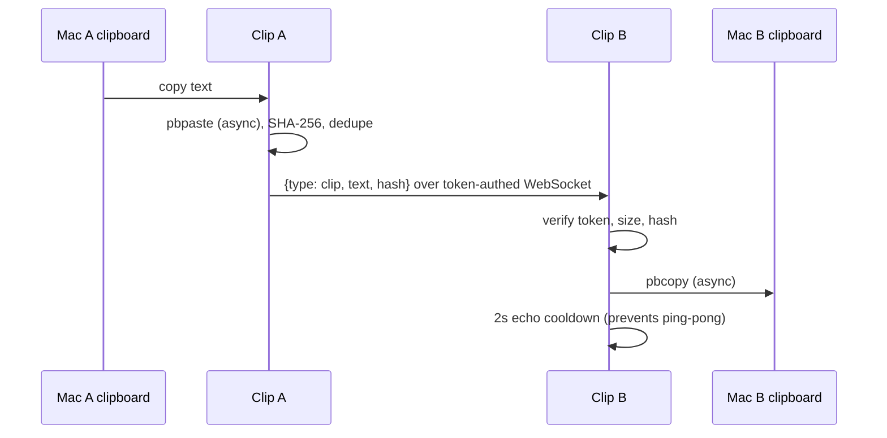

# Clip

A tiny macOS clipboard sync daemon: copy text on one Mac, it appears on the other over your LAN, with a searchable web history of everything you have copied.



[](LICENSE)


## Contents

- [Features](#features)
- [Architecture](#architecture)
- [How it works](#how-it-works)
- [Design decisions and trade-offs](#design-decisions-and-trade-offs)
- [Tech stack](#tech-stack)
- [Quick start](#quick-start)
- [Configuration](#configuration)
- [HTTP API](#http-api)
- [Project layout](#project-layout)
- [Security notes](#security-notes)
- [License](#license)

## Features

- Two-machine clipboard sync over the LAN via a token-authenticated WebSocket, no cloud relay.
- Bidirectional: copy on either Mac and the text lands on the other.
- SQLite-backed history (last 500 clips) with a searchable web UI at `http://localhost:4545`.
- Cmd+K command-palette search across everything you have copied.
- Per-clip actions: copy, edit in place, delete, favorite (UI-only, not persisted), and open a URL clip.
- Send a long clip to the [Stickies](https://github.com/bunlongheng) app in one click (optional).
- Duplicate cleanup: hash dedupe plus a fuzzy prefix pass, on demand or at boot.
- QR code and LAN URL to open the UI on your phone.
- Installs as a `launchd` agent that keeps running and restarts on crash.
- Installable PWA (manifest + icons).

## Architecture

A single Node process runs three things at once: a 400ms async clipboard poller, a peer WebSocket (both server and client, so either machine can initiate), and an HTTP server that serves the web UI and a second WebSocket that pushes live updates to the browser. Clipboard changes are detected by SHA-256 hash, persisted to SQLite, and fanned out to the peer and the UI. Everything except the static frontend and the local `/status` health check requires the shared `CLIP_TOKEN`.



| Module | Role |
|--------|------|
| `src/server.js` | Composition root - wires the HTTP app + peer/UI WebSocket upgrade routing together, boot() |
| `src/routes.js` | Express app: `/`, `/status`, and every `/api/*` route |
| `src/peer.js` | Clipboard poller, peer WebSocket (server + client), `/ws` and `/ui` upgrade auth |
| `src/history.js` | Write-time clip dedup (anti-smash/anti-stream/hash-bump) + UI broadcast fanout |
| `src/auth.js` | Shared-token check (timing-safe compare, bearer header / cookie / query) |
| `src/db.js` | SQLite persistence (better-sqlite3), dedupe and cleanup |
| `src/clipboard.js` | Async `pbpaste`/`pbcopy` wrapper (execFile, not a blocking execSync) plus SHA-256 hashing |
| `src/config.js` | Environment-backed settings; auto-generates and persists a strong `CLIP_TOKEN` if none is set |
| `src/net.js` | LAN IP helper |
| `public/` | Static frontend - `index.html` + `client.js`, served once the token check passes |

## How it works



Opening the web UI works the same way: `GET /?token=YOUR_TOKEN` once sets an `HttpOnly` cookie, and every later page load, `/api/*` call, and `/ui` WebSocket connection from that browser authenticates automatically via the cookie - no need to pass the token again.

## Design decisions and trade-offs

| Decision | Chosen | Alternative | Why this trade-off | Cost we accept |
|----------|--------|-------------|--------------------|----------------|
| Transport | Token-authenticated WebSocket over LAN | Cloud relay service | No third party ever sees your clipboard; nothing to host | Both Macs must share a network |
| Change detection | 400ms async `pbpaste` poll | Native pasteboard events | Zero native dependencies, dead simple, non-blocking | A small recurring CPU tick |
| History storage | Local SQLite (mode 0600), 500-clip cap | No history, or cloud sync | Browsable, offline, self-pruning | Stored unencrypted at rest |
| Auth | Shared token, gates the HTTP API + both WebSockets + the page itself | Full TLS or device pairing | One value to set, works on a plain home LAN | You must copy `CLIP_TOKEN` to the second machine yourself |

## Tech stack

- Runtime: Node.js (macOS, uses `pbpaste`/`pbcopy`)
- HTTP: Express 4
- Realtime: `ws` WebSockets (peer sync + UI push)
- Storage: SQLite via better-sqlite3 (WAL mode)
- Tests: Vitest (unit + a real two-subprocess peer-sync integration test) + Playwright (e2e) + MSW (mocked Stickies)
- Lint: ESLint (flat config) - `npm run lint`
- Service: macOS `launchd` agent

## Quick start

```bash
git clone https://github.com/bunlongheng/clip.git
cd clip
npm install

# Machine A - leave CLIP_TOKEN unset and Clip will generate + save a strong one to .env
CLIP_NAME=MacA CLIP_PEER=192.168.1.50:4545 npm start
cat .env   # copy the generated CLIP_TOKEN line to Machine B

# Machine B - use the SAME token you copied from Machine A's .env
CLIP_NAME=MacB CLIP_PEER=192.168.1.40:4545 CLIP_TOKEN=<paste it here> npm start
```

Open `http://localhost:4545/?token=<your CLIP_TOKEN>` once in your browser - that sets a cookie so every later visit just works at `http://localhost:4545`. Copy text on either machine and it syncs to the other; every clip shows up in the grid.

## Configuration

All configuration is environment variables (see `src/config.js` and `.env.example`). None are strictly required to start - if `CLIP_TOKEN` is unset (or left as an old public default), Clip generates a strong random one and saves it to `.env` on first boot. You must set `CLIP_PEER` and the SAME `CLIP_TOKEN` on both machines for sync.

| Env var | Default | Purpose |
|---------|---------|---------|
| `CLIP_NAME` | machine hostname | Label shown in the UI and stored as the clip source |
| `CLIP_PORT` | `4545` | Port for the web UI and WebSocket server |
| `CLIP_PEER` | (none) | The other machine as `ip:port`; empty means no sync, UI only |
| `CLIP_TOKEN` | auto-generated into `.env` if unset | Shared secret gating the page, the HTTP API, and both WebSockets - copy the SAME value to both machines |
| `CLIP_POLL_MS` | `400` | Clipboard poll interval in milliseconds |
| `CLIP_MAX_BYTES` | `102400` | Max clip size synced (larger clips are kept locally, not sent) |
| `CLIP_DB_PATH` | `./clip.db` | SQLite history file location |
| `STICKIES_API_URL` | `http://localhost:4444` | Optional: base URL for the send-to-Stickies feature |

`STICKIES_API_TOKEN` is not in this table on purpose - it is minted automatically by the send-to-Stickies flow on first use and persisted to `.env`; you never set it yourself. `CLIP_ENV_PATH` also exists (overrides where the `.env` file is read/written) but is a test-isolation knob, not something you need in normal use.

## HTTP API

Not a versioned public API - this is the same-origin surface the bundled web UI calls. Every route under `/api/*`, plus `GET /`, requires the shared token (bearer header, `?token=` query, or the `clip_token` cookie set after the first authenticated page load). `GET /status` is intentionally left open as a local health check (used by `npm run status`).

| Method | Path | Purpose |
|--------|------|---------|
| GET | `/status` | Health check - running state, peer status, history count (no auth) |
| GET | `/api/config` | `{ name }` - lets the static frontend bootstrap its "is this clip local" label |
| GET | `/api/clips` | List (or `?q=` search) clip history |
| PUT | `/api/clips/:id` | Edit a clip's text |
| DELETE | `/api/clips/:id` | Delete a clip |
| POST | `/api/dedup` | Run hash + fuzzy-prefix dedupe and mojibake cleanup |
| GET | `/api/qr` | `{ url, ip, port }` for the QR-code modal |
| GET | `/api/setup` | Peer-pairing instructions (never echoes the token itself) |
| POST | `/api/stickies` | Forward a clip to the Stickies app |
| WS | `/ws?token=` | Peer-to-peer clip sync (query-param token only - no cookie support) |
| WS | `/ui` | Live push to the browser (cookie or `?token=`) |

## Project layout

```
clip/
├── src/
│   ├── server.js     Composition root - wires everything together, boot()
│   ├── routes.js     Express app + all HTTP routes
│   ├── peer.js        Clipboard poller + peer WebSocket + /ws /ui upgrade auth
│   ├── history.js     Write-time dedup + UI broadcast fanout
│   ├── auth.js         Shared-token check
│   ├── db.js          SQLite history, dedupe, cleanup
│   ├── clipboard.js   Async pbpaste/pbcopy wrapper + SHA-256
│   ├── config.js       Env-backed settings + token auto-generation
│   └── net.js           LAN IP helper
├── public/
│   ├── index.html     Static app shell (served after the token check passes)
│   ├── client.js       Frontend logic
│   ├── manifest.json   PWA manifest
│   └── icon.svg         App icon
├── launchd/
│   └── com.bunlong.clip.plist   macOS LaunchAgent template
├── .github/workflows/
│   └── test.yml         CI: lint + vitest unit suite on every push/PR
├── test/
│   ├── unit/           Vitest unit + integration tests
│   ├── e2e/             Playwright specs
│   ├── helpers/         seed + factory + clip stub + two-daemon integration harness
│   └── msw/              mocked Stickies handlers
├── docs/screenshots/    README images
├── .env.example
├── eslint.config.js
└── package.json
```

## Install as a launchd service

```bash
# Edit launchd/com.bunlong.clip.plist: set the node path, the server.js path,
# your CLIP_PEER, and the real log paths (launchd does not expand ~), then:
cp launchd/com.bunlong.clip.plist ~/Library/LaunchAgents/
launchctl load ~/Library/LaunchAgents/com.bunlong.clip.plist

# Uninstall
launchctl unload ~/Library/LaunchAgents/com.bunlong.clip.plist
rm ~/Library/LaunchAgents/com.bunlong.clip.plist
```

Leave `CLIP_TOKEN` out of the plist and Clip will generate one into `.env` on first launch - copy it to the peer machine's `.env` (or set `CLIP_TOKEN` explicitly in both plists if you'd rather manage it that way).

## Security notes

Clip is built for a trusted home LAN, and now actually enforces a boundary at the application layer instead of only documenting one:

- The page, the entire HTTP API, and both WebSockets require the shared `CLIP_TOKEN` (timing-safe compare). `GET /status` is the one intentional exception, for local health checks only.
- A weak or missing `CLIP_TOKEN` is never silently accepted - Clip generates and persists a strong random one instead of falling back to an old public default.
- `.env` and the SQLite history file are both created with `0600` permissions.
- Clipboard history is still stored **unencrypted** in SQLite - anyone with read access to the machine (or `CLIP_DB_PATH`, if you point it somewhere shared) can read it. Do not point `CLIP_DB_PATH` at a shared location.
- Still bind this to a trusted network. The token stops casual/opportunistic LAN access; it is not a substitute for network-level trust.

## License

[MIT](LICENSE) (c) Bunlong Heng
